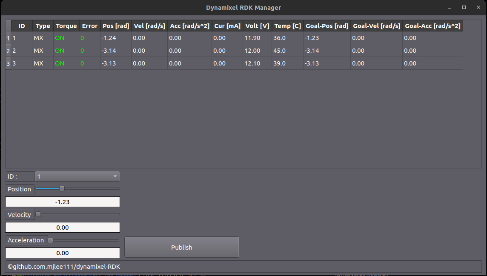

# Dynamixel RDK Manager

Dynamixel RDK를 위한 간단한 GUI입니다.

## Features
- Sync Read 및 Sync Write 지원
- Bulk Read 및 Bulk Write 지원
- Dynamixel RDK 메시지 지원

## Requirements
| Component | Version/Distribution | Notes |
|-----------|----------------------|-------|
| ROS2 |  Humble or higher | 권장 ROS2 배포 |
| Qt | 5.15.2 or higher | GUI를 위한 Qt |

## How to Use
```bash
$ ros2 run dynamixel_rdk_manager dynamixel_rdk_manager
```



## Contributing
I welcome all contributions! Whether it's bug reports, feature suggestions, or pull requests, your input helps me to improve. If you're interested in contributing, please check out my contributing guidelines or submit an issue.

## License
This project is licensed under the [Apache 2.0 License](LICENSE). Feel free to use and distribute it according to the terms of the license.

## Contact
If you have any questions or feedback, don't hesitate to reach out! You can contact me at [menggu1234@naver.com][email].

[email]: mailto:menggu1234@naver.com
